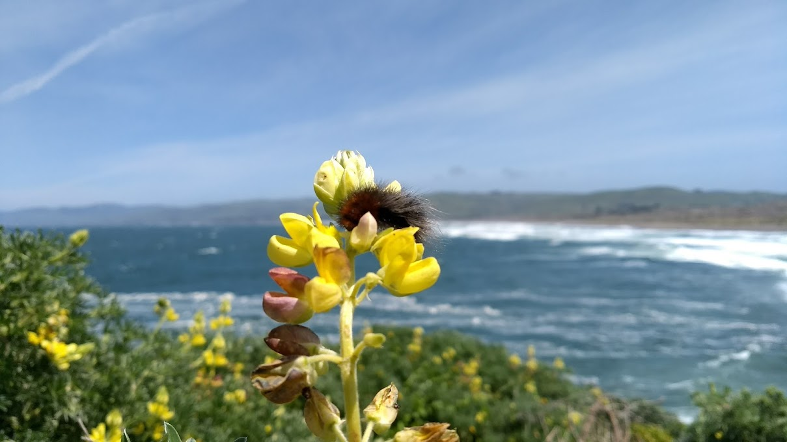
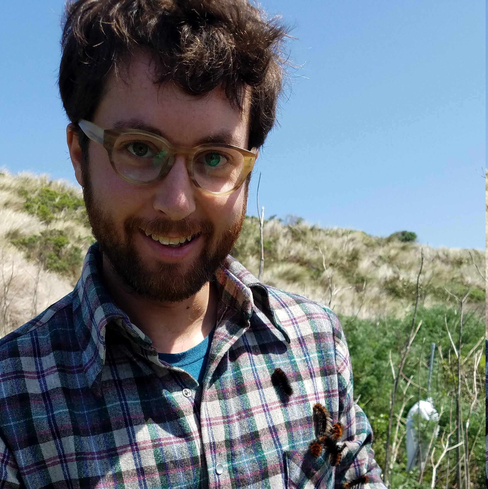

 

### Home
{width=1000px}

 

{width=200px}

I’m a PhD Candidate in Ecology at UC Davis, in the Karban and Holyoak labs. I did my M.S. in the Elkinton lab at University of Massachusetts Amherst, and a Fulbright fellowship with Birchmoth at University of Tromsø and the Norwegian Institute for Nature Research. I’m currently an (informal) visiting scholar with Jenny Cory at Simon Fraser University and Judy Myers at University of British Columbia.

I’m interested broadly in plant-insect population & community ecology, especially in the context of climate change. I also have an interest in the ecology and biological control of invasive insects.

 

