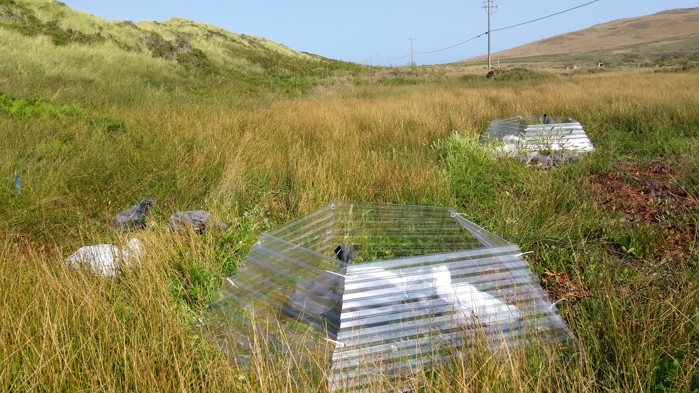
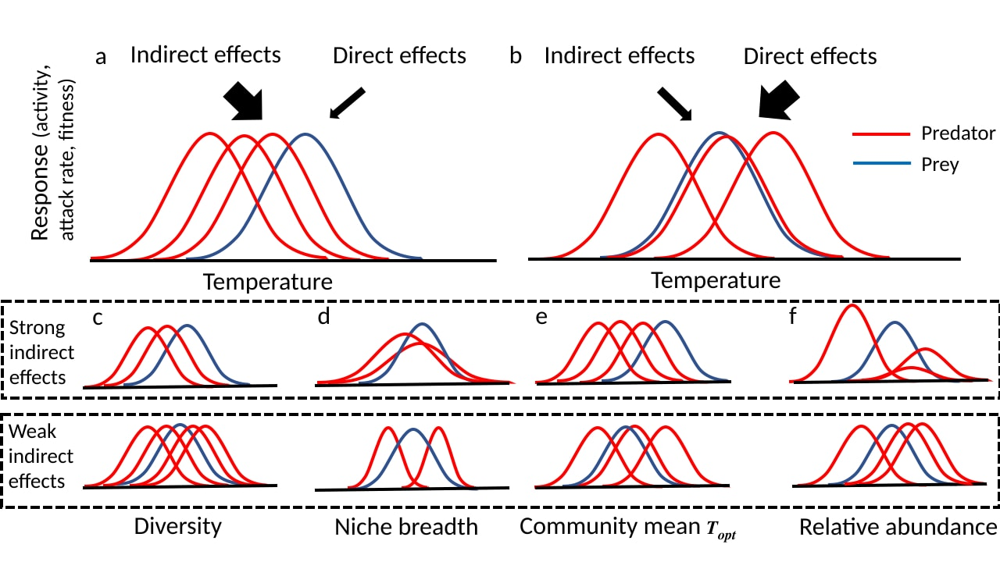
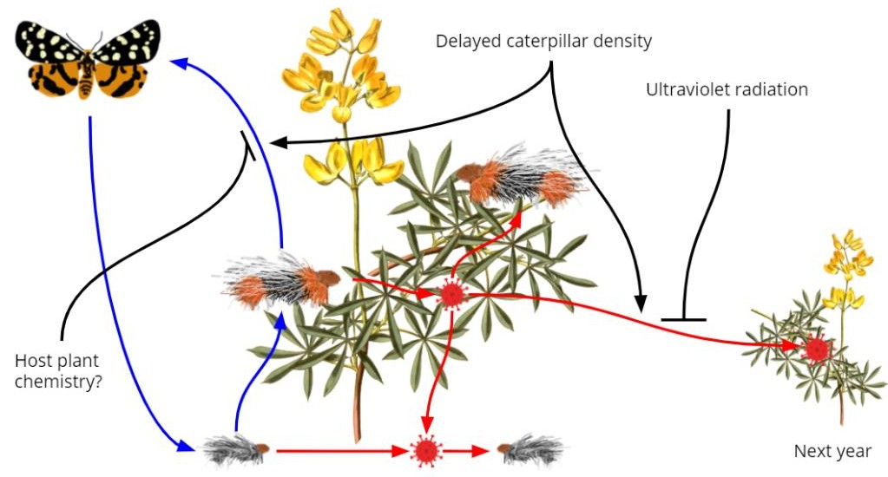

 

<figure style= "float:right;position: relative; top: 0px;padding:10px;width:400px">

<figcaption>
Open top chambers for a warming experiment at Bodega Marine Reserve, California.
</figcaption>

</figure>

My research interests are broad ranging in population and community ecology.  However, much of my work focuses around themes of leveraging ecological theory, quantitative methods and field data to understand the effects of climate change and invasion on population and community dynamics. One of my core research aims is to develop new ecological theory to these ends. My research interests can be organized into a few general areas:

**Climate change & population dynamics**

Climate change has broad ranging impacts on nature, from an ant that forages more quickly in warmer temperatures to droughts that transform plant communities.  These different outcomes are causally connected through impacts on individuals and populations. However, the diversity and complexity of the natural world make it difficult to resolve causal connections and predict how climate change will affect ecological communities.  Ecological theories developed about how geographic ranges are controlled, and how changes in populations are controlled by interactions such as competition, predation, and herbivory offer the basis to develop theory that is explicitly focused on understanding the potential effects of climate change. 

For example, populations are influenced by both a) biotic interactions such as competition and disease, caused by high population densities, and b) environmental conditions such as drought stress. The interplay between these two forces can result in a complex relationship between climate change and population dynamics. Using time series data collected over 35 years, I found that changing rainfall patterns in California interacted with disease dynamics in a population of caterpillars, resulting in a transition from non-cyclic to cyclic dynamics (1)⁠. Populations may also be differentially influenced by climate change depending on the current local climate.  For example, based on range limit theory, I predicted that woolly bear caterpillar populations are more likely to be affected by climate change-induced droughts via host plant limitation in the southern part of the species range relative to their northern counterpart.  Preliminary results from both observational and experimental studies suggest that droughts affect southern populations by reducing the food quality of caterpillars’ host plants. In contrast, northern populations are likely more limited by viral infection or insufficient warmth during the growing season.

<figure style= "float:right; padding:10px;width:500px">

<figcaption><small>
Figure 1. Schematic diagram of community traits that influence the relative importance of direct versus indirect effects of warming on interactions between prey (blue) and predators (red). Large asymmetries in thermal niches  will result in larger indirect effects of warming (a), whereas symmetric thermal niches will result in larger direct effects (b). Asymmetries in thermal responses between prey and predators and thus the relative magnitude of indirect versus direct effects depend on multiple aspects of the predator community thermal niche. Our results suggest that high diversity (c), narrow thermal niche breadth (d), correspondence between the community mean thermal optimum and prey thermal optimum (e), and an even predator species abundance distribution (f) will result in weaker indirect effects versus direct effects of warming. From Pepi and McMunn 2021, *Am. Nat.*</small>
</figcaption>
</figure>

**Temperature and predator-prey interactions**

Research has shown that climate warming affects ectotherm metabolic rate (2)⁠, resulting in greater activity, growth, feeding, and attack rates with higher temperatures (3)⁠.  This has the potential to change the outcomes of predator-prey interactions through relative effects of warming on predator and prey activity rates, growth rates, and attack rates, leading to strong indirect effects on prey survival of warming through changing interactions (4)⁠.  I have investigated the effect of warming on predator-prey interactions that are dependent on life stage. An increase in warming leads to two opposing effects: the window at which prey are most vulnerable is reduced due to shortened development time, but predators increase their attack rates. In this situation, whether warming benefits predators or prey depends on predator-prey thermal asymmetries (5).

I have also developed a theoretical model to examine temperature-dependent predator-prey interactions in multi-predator communities.  Nearly all previous empirical work examining warming effects on predator-prey interactions has considered single predator-prey pairs, even though most prey species interact with multiple predator species.  Using this model, I found that prey species interacting with multiple predators are less likely to experience strong asymmetries in thermal response rates (e.g., attack rate, growth rate) relative to predators, versus prey species interacting with fewer predators. This effect attenuates the indirect effects of warming due to predator-prey interactions on prey survival (6)⁠. This attenuation effect found in simulations depends on predator diversity, and thermal niche complementarity of predators, in which the thermal niches of predators are sufficiently different (i.e., low niche overlap; Figure 1). Several other aspects of the predator community thermal niche may influence the attenuating effect of predator diversity (see Figure 1).

<figcaption><small>
Figure 2: Diagram of drivers affecting infection levels of Ranchman’s tiger moth (*Arctia virginalis*) on yellow bush lupine (*Lupinus arboreus*).  Caterpillar density in the previous year increases infection levels in the current year, due to viral occlusion bodies left by cadavers. However, host plant chemistry might reduce infection in the current year, while ultraviolet radiation reduces infection in subsequent year by inactivating viral occlusion bodies. Artwork credit: Vincent Pan.</small>
</figcaption>

**Host-baculovirus dynamics**

Insect viruses are key factors in the the dynamics of many insect populations, driving cycles of many forest pests (8)⁠.  Beyond the basic tendency of many pathogens to drive cyclic dynamics, pathogens interact with a host of local factors that ultimately generate observed population dynamics. In line with this complexity, models of disease dynamics in Lepidoptera show that host-pathogen dynamics can vary greatly depending on multiple parameter values in models, such as those representing viral persistence, predation, population growth, and dispersal (9–11).  

I have been conducting research into the question of how spatial variation in population drivers affects host-baculovirus dynamics in Ranchman’s tiger moth (Arctia virginalis), using empirical research and mathematical modelling.  At a broad scale, we have found that higher ultraviolet radiation results in lower infection severity and higher survival rate, likely due to infection with lower doses of virus, due to inactivation of virus by UV (Figure 2; 12)⁠. 

At a more local scale, we have found that caterpillars in wet habitat patches are infected at higher levels than caterpillars in dry patches, which could be driven by either differences between viral persistence in the environment, or differences in average population density.  These differences in infection levels result in different cyclic dynamics between wet an dry patches, with dry patches having much higher amplitude oscillations (Pepi et al., unpublished).  In continuing work, we are interested in determining the mechanisms for wet-dry site differences in dynamics, and developing theoretical models to help understand how dispersal linkages between patches affect host-pathogen dynamics.  

<figure style= "float:right;position: relative; top: 0px;padding:10px;width:400px">

<figcaption>
Winter moth fieldwork in Troms, Norway. Picture credit: Jane Jepsen.
</figcaption>
</figure>

**Ecology & management of invasive forest pests**

Invasive forest insects have become an increasing problem in North America (13)⁠, particularly in the Northeastern states.  For some species – such as the Asian long-horned beetle and spotted lanternfly– eradication is still the primary control method (14)⁠. Other species – such as emerald ash borer, hemlock wooly adelgid, gypsy moth, and winter moth – have become well established and other methods, such as biological control, are more appropriate.  The effectiveness of biological control, through bio-pesticides (BT, viral isolates) or natural enemy importation, depends on an understanding of the determinants of pest population dynamics.  I have investigated forces regulating winter moth populations in both the invasive and native range. I found that populations were controlled by host plant limitation and dispersal in the invasive range in New England (15)⁠, and by bird predation in the native range in Norway (16)⁠. This, along with other work, supported the potential efficacy of implementing biological control for winter moth, which has ultimately been successful in New England (17)⁠.

**References**

1. 	Pepi A, Holyoak M, Karban R. Altered precipitation dynamics lead to a shift in herbivore dynamical regime. Ecology Letters. 2021;00:1-8 

2. 	Gillooly JF, Brown JH, West GB, Savage VM, Charnov EL. Effects of size and temperature on metabolic rate. Science. 2001;293(5538):2248–51. 

3. 	Kingsolver JG. The well‐temperatured biologist. The American Naturalist. 2009;174(6):755–68. 

4. 	Dell AI, Pawar S, Savage VM. Temperature dependence of trophic interactions are driven by asymmetry of species responses and foraging strategy. Journal of Animal Ecology. 2014;83(1):70–84. 

5. 	Pepi A, Grof-Tisza P, Holyoak M, Karban R. As temperature increases, predator attack rate is more important to survival than a smaller window of prey vulnerability. Ecology. 2018;99(7):1584–90. 

6. 	Pepi A, McMunn M. Predator Diversity and Thermal Niche Complementarity Attenuate Indirect Effects of Warming on Prey Survival. The American Naturalist. 2021;198(1):000–000. 

7.  Barton BT, Schmitz OJ. Experimental warming transforms multiple predator effects in a grassland food web. Ecology Letters. 2009;12(12):1317–25. 

8. 	Anderson RM, May RM. Infectious Diseases and Population Cycles of Forest Insects. Science. 1980;210(4470):658–61. 

9. 	Bjørnstad O, Robinet C, Liebhold AM. Geographic variation in North American gypsy moth cycles: subharmonics, generalist predators, and spatial coupling. Ecology. 2010;91(1):106–18. 

10.  Dwyer G, Dushoff J, Elkinton JS, Levin SA. Pathogen-driven outbreaks in forest defoliators revisited: Building models from experimental data. American Naturalist. 2000;156(2):105–20. 

11.  Fuller E, Elderd BD, Dwyer G. Pathogen persistence in the environment and insect-baculovirus interactions: Disease-density thresholds, epidemic burnout, and insect outbreaks. American Naturalist. 2012;179(3). 

12.  Pepi A, Pan V, Karban R. Influence of delayed density and ultraviolet radiation on caterpillar granulovirus infection and mortality. bioRxiv. 2021 Jan 1;2021.03.22.436482. 

13.  Brockerhoff EG, Liebhold AM. Ecology of forest insect invasions. Biological Invasions. 2017;19(11):3141–59. 

14.  Brockerhoff EG, Liebhold AM, Richardson B, Suckling DM. Eradication of invasive forest insects: concepts, methods, costs and benefits. New Zealand Journal of Forestry Science 40 suppl: S117-S135. 2010;40(suppl):S117–35. 

15.  Pepi A, Broadley HJ, Elkinton JS. Density-dependent effects of larval dispersal mediated by host plant quality on populations of an invasive insect. Oecologia. 2016;182(2). 

16.  Pepi A, Vindstad OPL, Ek M, Jepsen JU. Elevationally biased avian predation as a contributor to the spatial distribution of geometrid moth outbreaks in sub-arctic mountain birch forest. Ecological Entomology. 2017;42(4). 

17.  Elkinton JS, Boettner GH, Broadley HJ. Successful biological control of winter moth, Operophtera brumata, in the northeastern United States. Ecological Applications. 2021;31(5):e02326. 
 

<!-- Global site tag (gtag.js) - Google Analytics -->

